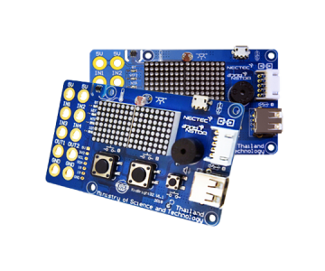

# NROC 🌽
An IoT and Machine Learning decision-support system for corn farming. 

  

  
  
  
  
  
  

### The Problem
Corn can be harvested at multiple stages (e.g., Baby Corn, Sweet Corn, Feed Maize). A farmer's daily dilemma is deciding whether to **cash out today** at the current market price or **pay maintenance costs to hold** the crop until the next growth stage. 

### What it does
NROC solves this by comparing the exact profit margins of both scenarios and outputting a straightforward **"Hold vs. Harvest"** recommendation.

---

### Architecture & Data
- **Hardware (IoT)**: An ESP32 deployed in the field gathering Soil Moisture (ZX-SOIL) and Temp/Humidity (DHT11/KY-015) every 30 minutes. (`/embedded`)
- **Market Data**: A Python scraper pulling daily wholesale corn prices from the Talaad Thai API. (`/fetch-data`)
- **Backend (FastAPI)**: Integrates the live IoT telemetry, web-scraped market prices, and OpenWeatherMap forecasts into a central API.
- **Frontend**: A React/Next.js (or Node-RED) dashboard displaying live sensor gauges, growth curves, price fluctuation charts, and the final recommendation.

---

### How the Decision is Made
NROC relies on two predictive models (trained on Kaggle and OAE datasets) to calculate future profitability:

1. **Growth Prediction (Linear Regression):** Estimates when the corn reaches the next harvest phase based on temperature, humidity, and soil moisture.
2. **Price Prediction (XGBoost):** Predicts future market prices based on historical trends.

The system then simply compares immediate vs. future profit:
* **Harvest Now:** `(Yield × Current Price) - Sunk Costs`
* **Hold Crop:** `(Yield × Predicted Price) - (Sunk Costs + Future Maintenance Costs)`

---

### Testing (Course 01219343)
To ensure reliability, the backend API and profit logic are strictly validated using `pytest`. This includes unit testing the mathematical equations, ensuring graceful handling of missing sensor data, and verifying correct OpenAPI HTTP status codes.
