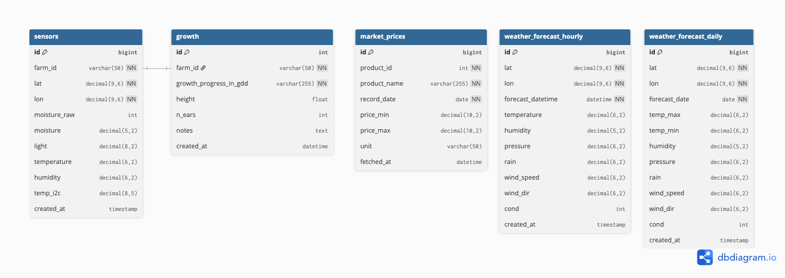

# NROC 🌽
> IoT sensor telemetry · TMD weather forecasts · Talad Thai market prices — unified in one decision-support dashboard for sweet corn farmers.

<p align="center">
  
  <br/>
  
  
  
  
</p>

## Overview
Modern farming means managing a lot of data. NROC takes precision agriculture data (like temperature, soil moisture, and light intensity from KidBright boards in the field) and combines it with external weather predictions and live wholesale prices. We use this to scientifically track your crop's **Growing Degree Days (GDD)**—predicting your harvest and maturity dates down strictly based on the heat your crops actually received. 

## System Architecture

Our dashboard pulls data through three primary avenues:
- **IoT Sensors**: KidBright ESP32 boards send MQTT JSON payloads right from the field.
- **Weather Fetcher**: Pulls 7-day reports from the Thai Meteorological Department.
- **Market Scraper**: Tracks the wholesale price of corn grades (Large, Medium, Small) via Talad Thai.

These meet at our **FastAPI** backend (Port `8000`), which normalizes everything to Bangkok Local Time (UTC+7) and saves it to a persistent **MySQL** database. Finally, it surfaces perfectly formatted data to our modern **Next.js** frontend (Port `3000`).

## Database Schema
We rely on 5 integration tables in MySQL to keep everything related:
`sensors`, `growth`, `market_prices`, `weather_forecast_hourly`, and `weather_forecast_daily`.

*Here is what our database layout looks like under the hood:*



## Quick Start

It's extremely easy to run the entire stack locally. Make sure you have Docker installed and a MySQL instance ready to accept connections.

**1. Set up your environment variables**
```bash
cp .env.template .env
# Fill in DB_HOST, DB_USER, DB_PASSWORD, DB_NAME
```

**2. Launch the NROC ecosystem!**
```bash
docker compose up -d --build
```

You can now open the **Dashboard** at `http://localhost:3000` and check out the interactive **API Documentation** at `http://localhost:8000/docs`.

If you prefer to run things manually for development:
```bash
# Terminal 1: Backend
pip install -r requirements.txt
uvicorn api.main:app --reload --port 8000

# Terminal 2: Frontend
cd dashboard
bun install
bun dev
```

## Inside the Dashboard

- **`/` (Landing View)**: A quick introduction to everything NROC does.
- **`/overview`**: The control center. It grabs live sensor stats, draws your crop's GDD curve, and shows you 7-day weather predictions and recent market prices at a glance.
- **`/monitor`**: Deep-dive sensor charts (you can drag to pan around) alongside a rain sparkline. You can export spreadsheet data from here anytime!
- **`/growth`**: Specifically dedicated to your plant development. Lets farmers log manual field observations directly into the database.
- **`/market`**: See exactly where price trends are going for all corn grades natively mapped over 30/60/90 days.
