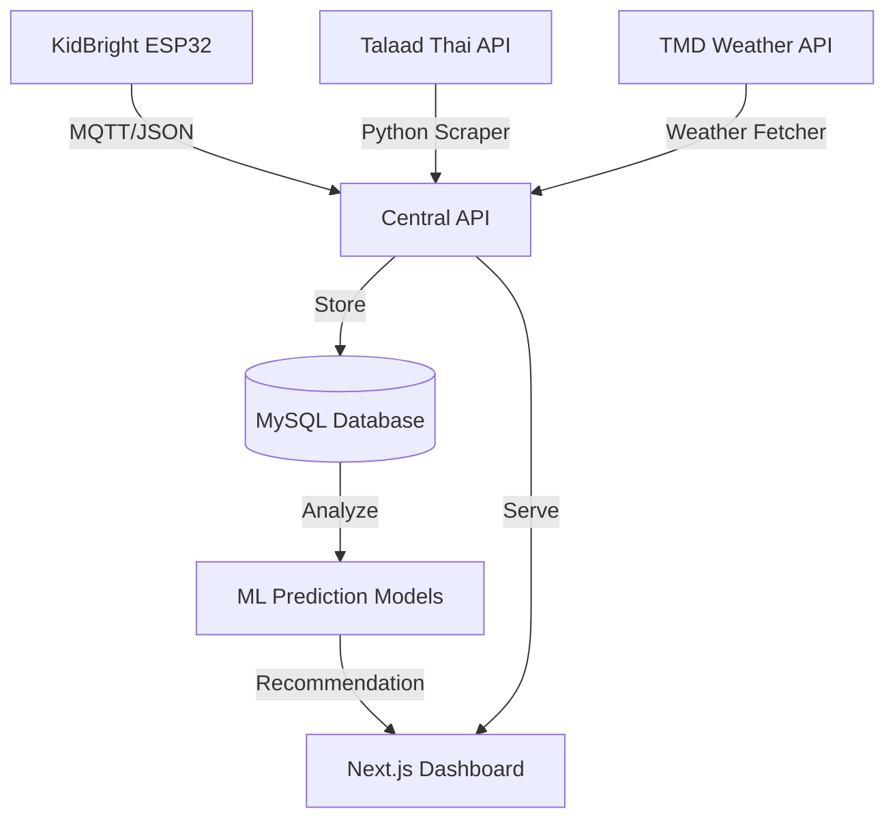

# NROC 🌽
> **Smart Corn Farming: An IoT & Machine Learning Decision Support System**

NROC helps corn farmers make data-driven decisions: **"Harvest today or hold for tomorrow?"** by comparing real-time field data (IoT) with market price forecasts (Machine Learning).

<p align="center">
  
</p>

<p align="center">
  
  
  
  
  
  
  
</p>

---

## 🛰️ System Data Flow


---

## ✨ Key Features
- **[Live Monitoring]** Real-time telemetry for soil moisture, light, and temperature.
- **[Market Analytics]** Automated daily price tracking for different corn grades.
- **[Weather Intelligence]** High-resolution forecasts integrated directly into farming logic.
- **[Smart ROI]** Automated "Harvest vs. Hold" recommendation based on profit margins.

---

## 🔌 Hardware Gallery (IoT)
The system uses the **KidBright** ecosystem to bridge the gap between the field and the cloud.

| Sensor | Purpose | Icon |
| :--- | :--- | :---: |
| **LM73 High-Precision** | Medical-grade soil/surface temperature monitoring. | 🌡️ |
| **DHT11 Climate** | Real-time ambient air temperature and humidity. | ☁️ |
| **Capacitive Soil** | Corrosion-resistant moisture sensing for growth tracking. | 💧 |
| **LDR Photoresistor** | Solar intensity measurement for photosynthesis analysis. | ☀️ |

---

## 🐳 Docker Deployment
Deploy the full stack (API + Dashboard) instantly using Docker Compose.

### 1. Setup Environment
```bash
cp .env.template .env
```

### 2. Run the System
```bash
docker compose up -d --build
```

### 3. Verify Access
*   **Farmer Dashboard:** `http://localhost:3000`
*   **Interactive API Docs:** `http://localhost:8000/docs`

---

## 🧠 Decision Support Logic
NROC uses two predictive models to calculate future profitability:

-   **Growth Prediction (Linear Regression)**: Estimates harvest dates based on Cumulative Growing Degree Days (GDD).
-   **Price Prediction (XGBoost)**: Forecasts market prices for the next 7-14 days.

> [!TIP]
> **The Golden Rule**: The system only recommends "Holding" the crop if the predicted future profit (minus maintenance costs) exceeds today's immediate payout by at least 15%.

---

## 🛠️ Local Development

### Backend (Python)
```bash
pip install -r requirements.txt
python3 -m uvicorn api.main:app --reload
```

### Frontend (Bun/Node)
```bash
cd dashboard
bun install
bun run dev
```
